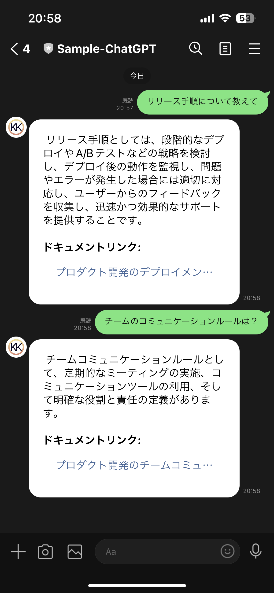

# ChatGPT とベクトルデータベースを利用したプライベートデータ専用の LINE チャットボットアプリケーション

これは、ChatGPT という強力な言語モデルと Pinecone というベクトルデータベースを使用した LINE ボットアプリケーションです。このアプリケーションでは、ChatGPT と Pinecone を利用してドキュメントに対する質問に答えることができます。

# 事前準備

LINE Messaging API チャンネル（LINE Developers コンソールで作成）
ベクトルデータベースの Pinecone：プライベートユーザーデータの保存と取得のため
インストール：[リポジトリ](https://github.com/kk-project/retrieval-private-data-line-chatbot)をクローンするか、ソースコードをダウンロードします。

プロジェクトディレクトリに移動します。

## Pinecone にドキュメントを追加する

[JSON ファイルを Pinecone に追加する](./scripts/README.md#usage)

## インストール

次のコマンドを実行して必要な依存関係をインストールします。

```bash
yarn install
```

## 環境変数の設定

.env.example ファイルをコピーして .env ファイルを作成します。

```bash
cp .env.example .env
```

LINE Developers コンソールで作成した LINE Messaging API チャンネルのチャンネルシークレットとチャンネルアクセストークンを .env ファイルに追加します。

OpenAI API Key は、[OpenAI API Keys](https://platform.openai.com/account/api-keys) から取得します。

ORGANIZATION 　は、オプショナルです。組織で使用する場合は、組織の名前を入力します。

## ローカル環境での使用方法

次のコマンドを実行してアプリケーションを起動します。

```bash
yarn start
```

[Ngrok](https://ngrok.com/) は、ローカルサーバーをインターネットに公開するためのツールです。公式ウェブサイトから Ngrok をダウンロードしてインストールします: 。

次のコマンドで Ngrok を起動し、ローカルサーバーへの安全なトンネルを作成します。

```bash
ngrok http 3000
```

Ngrok は転送用の URL（例: https://abcd1234.ngrok.io）を表示します。このURLをコピーします。

LINE Developers コンソールに移動し、チャネル設定を開きます。

「Messaging API」タブで、「Webhook URL」フィールドを Ngrok の URL に更新し、末尾に /webhook を追加します（例: https://abcd1234.ngrok.io/webhook）。

検証をクリックして、成功と表示されれば準備完了です。

「Messaging API」タブで、QR コードをスキャンして、LINE アカウントを友達に追加します。

メッセージを送信すると、ChatGPT が応答します。



# 免責事項

このアプリケーションは、ChatGPT とベクトルデータベースを LINE メッセージングプラットフォームと統合する方法を示すデモンストレーションです
